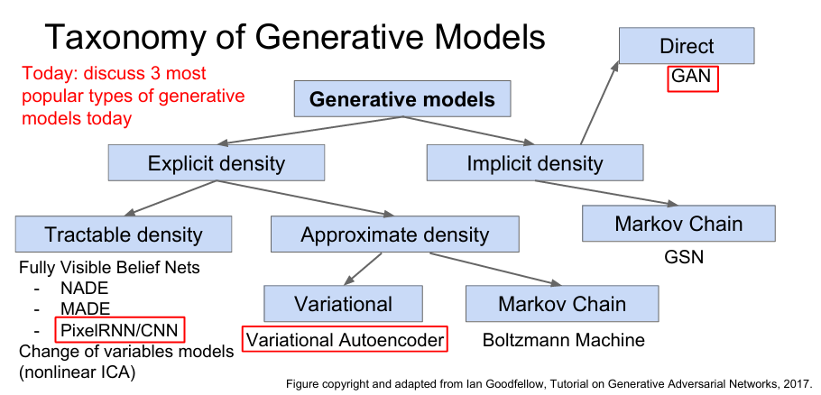

# (CS231n) Lecture 13 | Generative Models

Created: 2025년 5월 22일 오후 4:23

## Unsupervised Learning (비지도학습)

- **데이터만 있고, Label이 없음.** → training data를 구하기 비교적 쉬움. (cheap)
- Goal : 데이터의 숨겨진 구조를 학습하는 것.
- Ex) Clustering, 차원 축소, feature learning, density estimation 등

## Generative Models

Unsupervised Learning model의 한 종류.

p_data(x) 라는 분포에서 생성된 training data를 바탕으로 학습하여, p_model(x)라는 분포에서 샘플링을 통해 training data와 비슷한 데이터를 생성하는 모델. p_model(x)라는 분포를 p_data(x)와 최대한 비슷하게 되도록 학습시키는 것이 목표.

→ density estimation을 수행하게 됨.

Density estimation의 두 종류 :

1. **Explicit density estimation** : p_model을 명시적으로 정의함
2. **Implicit density estimation** : p_model을 명시적으로 정의하지 않고 학습시킴.

### Generative Models 의 종류

다음과 같이 Generative Model을 분류할 수 있고, 이번 강의에서는 PixelRNN/CNN, Variational Autoencoder, GAN 만 다룸.

---

## PixelRNN/CNN

Fully visible belief network : 모든 변수가 관측 가능함 (likelihood를 위와 같이 조건부 확률을 사용해 나타낼 수 있음). Explicit density model의 한 종류.

### PixelRNN

코너의 한 픽셀에서부터 시작하여 이전 픽셀 값들을 참고하면서 픽셀별로 이미지를 생성해냄.

이전 데이터(이전 픽셀)의 영향을 받기 때문에 RNN이 사용됨.

Problem : 순차적 생성 → **매우 느림.**

### PixelCNN

PixelRNN과 비슷하게 코너의 픽셀부터 시작하지만, 값을 구하고자 하는 픽셀의 주변에서 CNN을 사용하여 픽셀값을 생성함.

likelihood를 최대로 만들도록 학습을 수행함.

※ 비지도학습이지만 Softmax loss가 사용됨. 하지만 이것은 train data 그 자체와 비교한 softmax loss 이고, 그것에 대한 별도의 추가적인 정답 레이블은 존재하지 않으므로 비지도학습이라고 할 수 있음.

PixelRNN보다는 빠르게 작동하지만, 여전히 순차적으로 생성이 이루어지기 때문에 느리다.

---

## Variational Autoencoders (VAE)

PixelRNN/CNN 과는 달리, VAE는 **잠재 변수 z**를 추가하고 **intractable한 density function**을 설정함.

이것을 기존의 방법처럼 직접적으로 최적화 할 수는 없고, **lower bound를 설정하고 이것을 최적화**하는 방법을 반복함. 

### Background : Autoencoders

Unlabeled training data에 대한 낮은 차원의 feature representation을 학습하는 비지도학습.

Input data x 를 lower dimensional feature z로 보내는 mapping인 Encoder가 있음.

z는 일반적으로 x보다 크기가 작음(차원 축소) → z가 x의 가장 중요한 특성들을 나타낼 수 있도록.

- **어떻게 이런 z를 학습하는가? →**

Encoder에 의해 만들어진 z를 바탕으로  **Decoder를 통해 x_hat(reconstructed input data)를 생성해서 이것이 원래의 x와 최대한 유사해지도록** 함.

Encoder, Decoder에는 CNN 등이 사용됨. 

x와 x_hat 간의 L2 Loss function 사용.

이렇게 학습한 후 Encoder만 남기면 이를 supervised model을 initialize 하는 데 사용할 수 있었음.

→ small data 문제에서 overfitting을 어느 정도 방지할 수 있음.

그런데, 이것을 사용하여 새로운 이미지를 생성해낼 수는 없을까? → **Variational Autoencoders(VAE)**

### VAE

**기본 가정 : train data들은 잠재된(latent) 특징 z로부터 생성된 것임**

매개변수 : theta_star

: z의 확률밀도함수. 주로 가우시안 등으로 간단하게 설정됨.

: z가 주어졌을 때 x의 확률밀도함수. 복잡하므로 주로 신경망을 사용해 나타냄.

(수식에서는 확률밀도함수로 쓰이기도 하고 확률분포 그 자체를 나타내기도 한다.)

다음과 같은 likelihood를 최대화시키도록 학습시킴.

Problem : Intractable. 적분 계산이 안 됨.

→ Solution: 추가적인 **encoder network를 정의**하여 이것이 $p(z|x)$에 근사되도록 함.

Encoder 와 Decoder network의 구조.

평균과 분산을 학습하여 그렇게 학습된 분포에서 각각 z와 x를 sampling함.

log likelihood 수식 전개 과정.

결과적으로 마지막에 3개의 항이 나옴.

1. decoder network를 통해 학습되는 분포를 통해 계산 가능
2. encoder network를 통해 학습되는 z의 근사 사후 분포와 z의 사전 분포에 대한 KL divergence term. → 둘 다 가우시안 분포이므로 계산 가능.
3. encoder network를 통해 학습되는 z의 근사 사후 분포와 실제 z의 사후 분포에 대한 KL divergence term. → Intractable.

- **KL divergence** :

→ **P 기준에서 이것에 근사시킨 Q 모델이 얼마나 잘못된 모델인지**를 나타내는 함수.

위의 수식 전개에서 세 번째 항은 intractable이지만 이것이 KL divergence이므로 항상 0 이상이라는 것은 알 수 있음.

→ 1, 2번 항을 “**ELBO”** 라고 정의함.

**ELBO** : Evidence lower bound. $logp(x)$의 lower bound. (3번 항이 0 이상이므로.)

→ 3번 항은 intractable 하므로, **ELBO를 최대화** 하는 방향으로 학습을 진행함.

※ 1번 항 : decoder가 원래 input을 잘 복원하는지? / 2번 항 :  encoder가 prior(사전분포)를 잘 근사하는지.

### VAE 학습

VAE의 forward pass를 나타낸 그림.

encoder에서  $q(z|x)$, decoder에서 $p(x|z)$를 얻을 수 있고 p(z)는 우리가 정의한 사전 분포이므로 ELBO를 계산 가능함.

그리고 나서 Gradient decent를 통해 최적화를 진행.

그대로 x를 출력하기를 원하므로 x에 대한 L2 loss 사용.

### Generating Data

학습된 VAE로 새로운 데이터를 생성할 때는 decoder만을 이용함.

또한 여기서 z는 사전 분포에서 샘플링된 z임.

---

## GAN (Generative Adversarial Networks)

PixelCNN이나 VAE와는 달리, **density function을 직접적으로 정의하지 않음**. → **Implicit density estimation**에 속함.

대신 **‘game-theoretic’**한 접근 방식을 사용해 데이터 생성을 학습하고자 함.

매우 복잡한 training distribution에서 샘플링을 하여 이미지를 생성하고 싶음. 하지만 직접적으로는 불가능함.

→ random noise같은 간단한 분포에서 샘플링하고, 신경망을 통해 이것을 training distribution 으로 보내는 변환을 학습하고자 함.

2가지의 network 간의 game을 통해 학습함.

**Generator network(G)** : 최대한 실제같은 이미지를 생성하여 discriminator를 속이고자 함.

**Discriminator network(D)** : 실제 이미지와 Generator 가 만들어낸 가짜 이미지를 구별하고자 함.

목적함수는 위와 같이 정의됨.

수식 해석 :

**D**는 진짜 이미지에 대한 출력을 1, 가짜 이미지에 대한 출력을 0에 가깝게 만들어서 **위의 수식을 최대화**하고자 함.

**G**는 D의 가짜 이미지에 대한 출력을 1에 가깝게 만들어서 **위의 수식을 최소화**하고자 함.

(비지도학습이므로 기본적으로 데이터에 label이 없지만, 학습을 위해 가짜 이미지에는 0, 진짜 이미지에는 1 이라는 레이블을 부여함. 

별도로 지정을 해줘야 하는 외부 레이블은 없음.)

### GAN training 방법

다음과 같은 Gradient ascent와 descent를 반복함.

그러나 위 과정을 그대로 실행할 경우, generator의 학습이 제대로 되지 않을 수 있음.

$y=log(1-x)$ 라는 함수의 그래프를 생각해보면, 1 근방에서는 기울기가 가파르고, 1에서 멀어질수록 기울기가 완만해짐.

그런데 Generator는 위 함수의 x 자리에 들어가는 $D(G(z))$를 1에 가깝게 만들고 싶어함.

→ 학습이 진행되지 않아 성능이 안 좋은 시점(1에서 먼 시점)에서는 기울기가 완만하여 학습이 거의 진행되지 않고, 학습이 어느 정도 진행된 시점(1 근처)에서는 기울기가 가파르기 때문에 오히려 이때 학습이 더 잘 됨.

→ 우리는 성능이 안 좋을 때 학습이 더 잘 진행되었으면 좋겠음.

따라서 위와 같이 Generator에 대해서도 Gradient ascent를 사용해줌.

( **$log(1-x)$를 최소화 →  $log(x)$를 최대화**)로 변경.

결국 목적은 $D(G(x))$를 1에 가깝게 만드려고 하는 건 같지만, 바뀐 함수의 그래프를 생각해보면 x가 1에서 멀 때 기울기가 더 가파르므로 성능이 안 좋을 때 학습이 더 잘 진행될 수 있음.

GAN training 알고리즘.

GAN은 이번 강의에서 살펴본 모델 중 가장 최신의 모델이고, 좋은 결과를 내지만, 때로는 학습이 불안정할 수 있다는 단점이 있다.

---