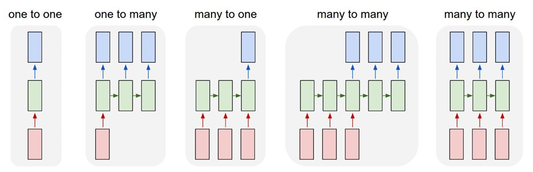

# (CS231n) Lecture 10 | Recurrent Neural Networks

Created: 2025년 5월 20일 오후 5:23

## Vanilla Neural Network :

지금까지 다뤘던 모델들처럼 고정된 크기의 입력을 받고 Hidden Layer를 거쳐 single output을 내놓는 구조의 신경망. 

→ but 우리는 더 높은 유연성을 원함.

## Recurrent Neural Networks (RNN) :

입력과 출력을 다양하게 조절 가능. (one to many, many to one, many to many)

## RNN의 기본 구조 :

입력을 받을 때 마다 RNN 내부의 hidden state를 업데이트함. 그리고 이 hidden state는 다음 입력을 읽을 때 모델에 다시 피드백됨.

수식으로 나타내면 다음과 같음. (old state 와 input vector at some time step 을 변수로 받아 특정 계산을 수행하고 이것을 new state의 값으로 정함.)

매 step 마다 같은 가중치 W를 사용하는 것에 주의.

## Seq to Seq model 구조 :

**Encoder(Many to one) + Decoder(one to many)** 로 구성된 모델.

번역 작업 등에 활용됨.

한 번에 처리하는 단위를 단어 또는 문장 등 다양하게 선택 가능.

글자 단위로 처리하는 모델을 생각해보면 위와 같은 구조를 가짐. (이전 글자들을 바탕으로 다음 글자를 예측)

위의 식을 사용하여 hidden state를 계산함. (이전 hidden state와 새로운 입력을 바탕으로 새로운 hidden state를 계산)

출력할 때 확률 분포에 따라 Sampling을 할 수도 있고 argmax를 이용할 수도 있음.

Sampling을 이용할 경우 모델의 다양성을 확보할 수 있고, argmax를 이용할 경우 안정성을 높일 수 있음.

## Backpropagation of RNN

RNN에서 역전파를 처리할 때, 계산 흐름이 매우 길어짐.

→ 시간 및 메모리의 낭비,  **gradient가 수렴하지 못할 확률 높음.**

→ **Truncated Backpropagation** 사용!

## Truncated Backpropagation :

sequence를 **일정한 구간마다 나누어서 역전파를 한 구간 내에서만 계산.**

(순전파 시에는 원래와 같이 이전 hidden state도 함께 입력받음.)

→ 위에서 언급했던 RNN에서의 역전파 시 문제(시간 및 메모리의 낭비,  gradient가 수렴하지 못할 확률 높음.)를 해결 가능

## RNN 활용

CNN과 RNN을 결합하여 이미지에 대한 설명을 출력하는 모델을 만들 수 있음.

이 경우 CNN의 출력(이미지 정보)을 RNN의 hidden state에 반영해주기 위해 새로운 가중치 W_ih도 정의해줌.

## LSTM (Long Short Term Memory)

앞서 살펴본 RNN은 전부 hidden state가 1개인 모델이었음.

이것을 확장하여 hidden state가 여러 개인 모델도 다뤄보고자 함. → LSTM

**Vanilla RNN의 문제점** : 한 셀을 지날 때마다 W가 계속 곱해짐 → W의 크기가 1보다 클 경우 **기울기 폭발**, 1보다 작을 경우 **기울기 소실**이 일어날 수 있음.

기울기 폭발은 Gradient clipping(기울기의 크기 제한) 으로 어느 정도 방지 가능하지만 기울기 소실은 RNN의 구조 자체를 변경할 필요가 있음.

**→ LSTM의 등장 : 기울기 폭발 및 소실을 해결 가능.**

LSTM의 기본 구조. **i, f, o, g 라는 4개의 게이트를 사용하여 c, h라는 2개의 셀 상태를 업데이트함.**

f : Forget gate

I : Input gate

g : Gate gate

o : Output gate

f, i, o는 sigmoid 사용 → 값이 0과 1 사이.

반면 g는 tanh 사용 → 값이 -1과 1 사이.

각 셀 마다의 출력은 h_t를 사용함.

**c : 장기 기억용**

**h : 단기 정보 + 출력용**

으로 이해하면 될 듯 함.

LSTM 구조 도식화.

Vanilla RNN에서는 역전파 시에 같은 가중치 W를 계속 곱하는 연산이 이루어졌음.

반면 LSTM의 역전파 시에는 c(cell state)의 역전파를 생각해보면 **덧셈과 요소별 곱으로만 이루어져있음**.

→ 기본적으로 행렬곱을 사용하지 않고, 요소별 곱을 수행하는 대상인 f(forget gate)도 매 셀마다 달라지기 때문에  **기울기 폭발 혹은 소실 문제를 방지할 수 있음. (같은 W가 반복해서 곱해지는 일이 없음)**

또한 Vanilla RNN에서는 역전파 시에 한 셀을 지날 때마다 tanh 연산을 거쳐야 했지만, LSTM에서는 각 h_t마다 tanh를 한 번만 지난 후 이후로는 c의 경로를 따라(빨간 화살표) 기울기가 전달되기 때문에 학습이 용이함.

c의 경로가 일종의 ‘gradient highway’로 작용함.