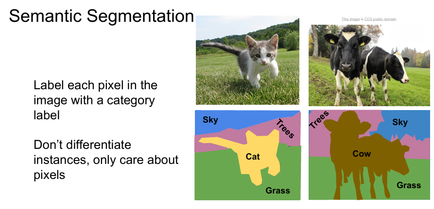

# (CS231n) Lecture 11 | Detection and Segmentation

Created: 2025년 5월 21일 오후 9:47

## Semantic Segmentation

**의미적 분할**. 이미지의 각 픽셀이 어느 물체(클래스)인지 판별하는 작업.

(같은 클래스의 객체가 2개 이상 있어도 그 둘을 구분하지 않음. 그냥 같은 클래스로 분류함)

### Semantic Segment를 어떻게 수행할 수 있을까? →

### 1. Sliding Window → bad

이미지의 일부분을 가져와서 그 중심 픽셀이 어느 클래스에 속하는지 CNN을 통해 판별.

→ **매우 비효율적**. 계산량 매우 많음 & 중복되는 영역에 대한 효율적인 처리가 고려되어있지 않음.

### 2. Fully Convolutional

이미지 전체를 cnn에 통과시킴. → C x H x W 크기의 score를 얻고 argmax를 사용해 픽셀 별로 class 예측.

→ 여전히 **계산량이 많음.** 전체 이미지에 대한 conv layer를 계산하려면 계산량이 매우 많음. (해상도가 너무 높음)

### 해결법 : **downsampling & upsampling**

Conv layer를 통과하는 과정에서 원래 **이미지의 해상도를 줄였다가 다시 원래대로 복구해서 출력함.**

→ 계산량을 줄일 수 있음.

Downsampling → Pooling or stride 조정으로 처리 가능.

Upsampling → **unpooling** or **Transpose Convolution** 사용.

### Unpooling

- **Nearest Neighbor** : 주변의 픽셀을 그대로 복사함.
- **Bed of Nails** : 코너에 픽셀값을 넣고 나머지는 0으로 채움.
- **Max Unpoolin**g : downsampling 시에 max값들의 위치를 기억해뒀다가 upsampling 시 그 위치에 픽셀값을 넣고 나머지는 0으로 채움.

→ 위의 세 방법은 고정된 연산이며 upsampling 방법을 정확히 학습하지는 않음.

### Transpose Convolution : Learnable Upsampling

일반적인 Convolution과 비슷하게 filter가 이동하면서 input의 값들과 filter 의 가중치가 곱해짐.

다만 일반 convolution 연산은 요소별 곱이 이루어지는 반면, Transpose Convolution에서는 input이 통째로 filter에 곱해짐 ( output size 가 input size보다 커야 하기 때문)

→ 가중치가 존재하므로 이런 방식의 Upsampling은 “**Learnable(학습가능)**”함. → 좋은 성능 기대 가능.

### Transpose Convolution이라는 이름이 붙은 이유? :

일반 Conv와 transpose Conv를 행렬곱으로 다음과 같이 각각 나타낼 수 있음.

일반 Conv에서는 filter와 input 간의 요소별 곱이 이루어 지는 걸 볼 수 있음.

반면 Transpose Conv에서는 filter의 가중치에 input에 통째로 곱해짐.

이 연산을 a * col1 + b * col2 과 같이 연산되는 것으로 생각하면 다음과 같이 행렬곱으로 표현할 수 있고, 이는 일반 conv에서 filter의 matrix가 transpose 된 모양이라고 생각 가능.

## Classification + Localization

객체를 분류하는 것 뿐만 아니라, 그 객체가 어디 있는지 판단하고 싶음. (객체를 둘러싸는 상자를 그리고 싶음.)

이미지를 cnn에 통과시킨 후 그렇게 나온 벡터를 바탕으로 class scores를 계산하는 FC net 뿐만 아니라, **Box의 위치를 계산**하는 FC net을 추가해줌.

각 FC net에서 Loss를 각각 계산한 후 이를 가중치합 해줌. **(Multitask Loss)**

비슷한 느낌으로 여러 개의 Loss를 가중치합 해주는 과정은 Human Pose Estimation 등에도 활용됨.

(사람의 주요 관절의 위치를 예측)

## Object Detection

이미지에서 관심 있는 class 들에 해당하는 객체를 찾아내고 이를 박스로 표현.

한 이미지에 대해 출력이 몇 개일지 알 수 없음. ( 한 이미지에 여러 객체가 있을 수 있음 )

### Sliding Window : traditional way

Semantic Segmantation의 그것과 비슷한 아이디어.

작은 패치(이미지의 일부분)을 가져와서 cnn에 통과시킨 후 그곳에 객체가 있는지, 어떤 객체인지 판별. ( 객체가 없다면 배경 이라는 class를 예측 가능 )

→ Problem : 객체가 존재할 수 있는 영역은 너무나 다양함. 모든 경우에 대해 이런 연산을 적용할 수는 없음.

### Region Proposals

딥러닝은 아님. 하나의 고정된 알고리즘.

객체가 있을 가능성이 있는 영역 (뭉쳐진 영역?)을 1000개~2000개 정도 제안해줌.

상대적으로 실행이 빠름.

(cs231n에서는 자세한 원리를 다루지는 않는 듯함.)

### R-CNN

1. Region Proposal을 사용하여 이미지에서 관심 영역(**ROI : Regions of Interest**)을 설정함. (약 2000개정도)
2. CNN에 입력해주기 위해 각 ROI를 동일한 크기로 맞춰주는 Layer를 통과시킴.
3. ConvNet + SVM으로 class 판별
4. Region Proposal로 얻어낸 ROI가 정확한 객체의 위치를 나타내지 않을 수 있기 때문에 box의 위치에 대한 예측도 학습. (Multitask Loss)

→ Problem : **계산이 오래 걸림**. (2000개의 ROI에 대해 각각 CNN 통과). Train & Test 모두 느림.

### → Fast R-CNN

1. **이미지 전체**를 CNN에 통과시킨 후, 그 결과로 만들어진 **feature 정보에 대해서 ROI를 설정.**
2. 고정된 크기로 통일해주기 위해 **ROI pooling layer** 라는 것을 사용
3. 이후 FC net 통과 후 class 판별 및 box 위치 예측.

ROI pooling : 

강의에서는 max pooling과 유사하다 정도만 언급하고 바로 넘어감.

Train 단계에서는 Fast R-CNN이 일반 R-CNN보다 약 10배 가량 빠름.

Test 단계에서는 Fast R-CNN은 Region proposal 단계를 제외하면 거의 시간이 소요되지 않음.

### Faster R-CNN

Region proposal 단계까지 빠르게 처리하는 모델.

**Region proposal 단계도 CNN을 사용하여 학습.** → **RPN** (Region Proposal Network) 추가

따라서 총 4개의 loss를 계산하게 됨. (RPN classification, RPN box, Final classification, Final box)

RPN classification 시에는 선택한 영역이 object인지 not object인지 판별.

Test time speed 비교.

### YOLO / SSD

Region Proposal 없이 Detection을 수행하는 모델들.

**YOLO : You only look once**

**SSD : Single Shot Detection**

여러 개의 ROI 로 나누어서 각각에 대한 예측을 수행하는 것이 아니라, **이미지 전체를 회귀 문제처럼 처리**하고 **큰 CNN으로 한 번에 예측**을 내리는 모델.

이미지를 7 x 7 개의 격자로 나눈 후, B개의 base box를 final box에 대해 regression. 

(dx, dy, dh, dw, confidence(classification score)의 총 5개에 대해)

각각 Class scores도 계산해야하므로 Output의 shape은 7 x 7 x (5B + C)가 됨. → 3차원 텐서로 생각하고 통째로 CNN을 통해 처리.

속도는 SSD가 빠르고 정확도는 Faster R-CNN이 높은 것으로 나타남.

## Instance Segmentation

픽셀별로 class를 판별하고 같은 class의 다른 객체 또한 구별.

### Mask R-CNN

Faster R-CNN과 구조적으로 유사함.

Faster R-CNN과는 다르게 Final 단계에서 단순히 box의 위치를 예측하는 것이 아니라 각 구역(ROI)에 대해 **각 class들의 mask를 학습하고자 함.** 

(각 ROI 내부에서 Semantic Segmentation을 처리하는 것처럼 볼 수 있음.)
